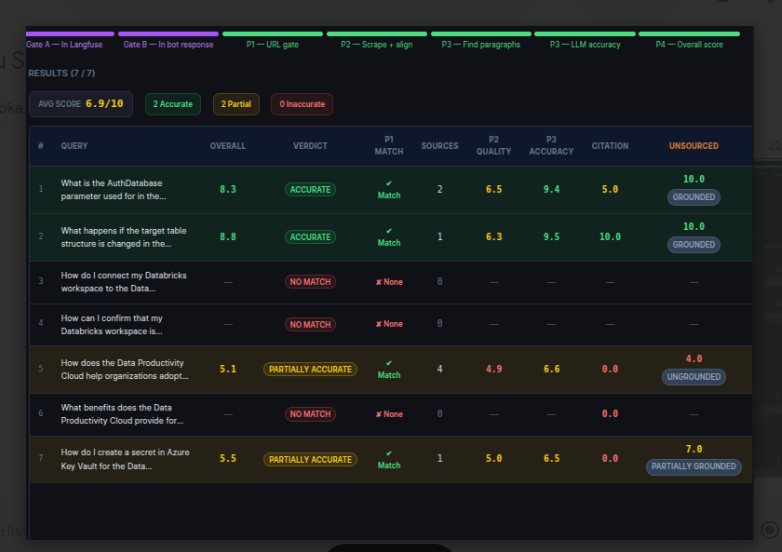

# [SUVA Relevancy Automation](https://github.com/abhijeetGithu/RAG-Quality-Evaluation-Suite/tree/main)

**An end-to-end evaluation platform that automatically tests how good an AI support chatbot's answers really are.**

Companies increasingly ship AI support agents (RAG-based chatbots that answer customer questions using their help-center documentation). But how do you *know* the bot is citing the right articles, not hallucinating facts, and not quoting stale documentation? This project answers that question automatically — it drives a real browser session against a live support bot, pulls the bot's internal retrieval trace from an LLM observability platform, and runs a multi-stage LLM-as-a-judge pipeline that scores every answer for accuracy, source quality, and grounding.

It ships as a **FastAPI backend + Next.js dashboard**, with a legacy **Flask + CLI** toolchain still available for scripted batch runs.

---

## Source Code

The complete source code for this project is not publicly available as it contains my company-specific and proprietary implementation details which i can't share here.

For interview or verification purposes, a version of the project will be shared through the following Google Drive link:

**Google Drive:** [Drive Link](https://drive.google.com/file/d/1rnhCg1n9skXIoWnIEf9nTvqMf5tnLUVH/view?usp=sharing)

> *This Drive link I will makee available for the interview process or upon request for code verification.*

## 🖼️ What it looks like

**Live pipeline run — real-time logs, step tracker, and per-query scoring as the browser and LLM judge work through a batch:**


**Batch results table — every query scored 0–10 with verdicts (Accurate / Partially Accurate / Inaccurate), source-match status, and citation grounding:**



---

## The problem it solves

Support bots built on **Retrieval-Augmented Generation (RAG)** fetch documents from a knowledge base, then let an LLM compose an answer from them. Two things commonly go wrong and are hard to catch by hand:

1. **Retrieval failure** — the bot cites the wrong article, or no article at all, even when a good one exists.
2. **Generation failure** — the bot's answer drifts from what the retrieved article actually says (hallucination), misses key details, or quotes outdated content.

Manually checking hundreds of Q&A pairs against source docs doesn't scale. This tool automates the whole loop — ask, retrieve the bot's real reasoning trace, compare against the live web page, and grade it — and produces an auditable score with an explanation for every query.

---

## How it works (pipeline walkthrough)

For every query in an uploaded spreadsheet, the system runs a **10–12 step pipeline**:

1. **Bot interaction** — [Playwright](https://playwright.dev/) drives a real headless Chromium browser into the support portal (Salesforce Experience Cloud / SearchUnify), types the query, and scrapes the rendered answer and its cited source links from the DOM — no API mocking.
2. **Trace ingestion** — waits for the bot's backend to finish logging, then pulls the corresponding **[Langfuse](https://langfuse.com/) LLM observability trace** via its REST API — the same trace the engineering team would open to debug the bot, containing every retrieval call the bot made internally.
3. **Format validation & document extraction** — parses the raw trace into a clean list of retrieved documents (title, URL, content).
4. **Query–document relevance scoring** — an LLM judge scores how relevant each retrieved document actually is to the question, and computes a **citation score** (were the genuinely relevant documents the ones the bot actually cited?).
5. **Phase 1 — URL Matching Gate** — deterministically matches the bot's cited links against the documents Langfuse says were retrieved.
6. **Phase 2 — Source Quality** — re-scrapes each matched URL live and diffs it against the indexed version the bot used, flagging **outdated content** the knowledge base hasn't refreshed.
7. **Phase 3 — Accuracy Analysis** — an LLM judge (GPT‑4o‑mini) compares the bot's answer paragraph‑by‑paragraph against the source document, scoring **factual accuracy, completeness, structural completeness, and clarity**, and explicitly lists any missing, incorrect, or hallucinated claims.
8. **Phase 3c — Unsourced Narrative Grounding** — a dedicated check on any part of the answer *not* backed by a citation, to catch silent hallucination.
9. **Phase 4 — Weighted Overall Score** — combines Accuracy (50%), Source Quality (25%), Grounding (15%), and Citation (10%) into a single 0–10 verdict (`ACCURATE` / `PARTIALLY_ACCURATE` / `INACCURATE`).

An optional **"Expected Document" mode** adds two upfront gates — confirming the document you expected actually appeared in the bot's retrieval trace (Gate A) and was cited in its answer (Gate B) — for targeted regression testing against known-good answers.

Every step streams live to the UI over **Server-Sent Events (SSE)**, and results are written incrementally to CSV/Excel so a long batch never loses progress.

---

## Architecture

```
┌─────────────────┐        HTTP/SSE        ┌──────────────────────┐
│  Next.js UI      │◄──────────────────────►│  FastAPI backend      │
│  (React + TS +   │  upload sheet, stream   │  (api/main.py)        │
│   Tailwind CSS)  │  logs, fetch results    │                       │
└─────────────────┘                        └──────────┬────────────┘
                                                        │
                                             ┌──────────▼────────────┐
                                             │  Pipeline runner       │
                                             │  (api/pipeline/)       │
                                             └──────────┬────────────┘
                     ┌──────────────────────────────────┼──────────────────────────────┐
                     ▼                                  ▼                              ▼
          ┌────────────────────┐          ┌────────────────────────┐      ┌──────────────────────┐
          │  Playwright         │          │  Langfuse REST API      │      │  LLM Judge             │
          │  (Chromium browser  │          │  (retrieval trace +     │      │  (OpenAI GPT-4o-mini / │
          │  automation)        │          │  observability data)    │      │  Google Gemini)        │
          └────────────────────┘          └────────────────────────┘      └──────────────────────┘
```

A separate **CLI + Flask stack** (`main.py`, `app.py`, `analysis.py`) implements the same core ideas for scripted/headless batch runs and an older single-page UI — useful when a full dev server isn't needed.

---

## Tech stack

| Layer | Technology | Why it's used |
|---|---|---|
| Backend API | **FastAPI**, Python 3, Uvicorn | Async REST API + Server-Sent Events for real-time job streaming |
| Frontend | **Next.js 14 (App Router)**, React 18, **TypeScript**, **Tailwind CSS** | Type-safe dashboard with file upload, live logs, and results visualization |
| Browser automation | **Playwright** (Chromium) | Drives the actual chatbot UI like a real user — no reverse-engineered private APIs |
| LLM observability | **Langfuse** (REST API) | Pulls the bot's ground-truth retrieval trace instead of guessing what it fetched |
| LLM providers | **OpenAI (GPT-4o-mini)**, **Google Gemini (2.5 Flash)** | LLM-as-a-judge scoring, structured JSON output, query generation |
| Legacy web layer | **Flask**, Flask-CORS | Original SSE-based single-page app (`app.py`) |
| Data handling | **pandas**, **openpyxl** | CSV/Excel ingestion and report generation |
| Web scraping | **BeautifulSoup4**, **requests** | Fetches live document HTML for source-quality comparison |
| Multi-tenant design | Config-driven `CLIENT_CONFIGS` | Same pipeline supports multiple bots/portals (nCino Salesforce bot, Matillion SearchUnify) via a config switch, not code forks |

**Concepts demonstrated:** Retrieval-Augmented Generation (RAG) evaluation, LLM-as-a-judge design, prompt engineering with structured JSON outputs, browser automation/QA tooling, real-time streaming APIs (SSE), observability/tracing integration, weighted multi-criteria scoring systems, full-stack TypeScript + Python development.

---

## Project structure

```
.
├── api/
│   ├── main.py                       # FastAPI app: job upload, SSE stream, results, CSV export
│   └── pipeline/
│       ├── runner.py                 # Orchestrates the full 10–12 step scoring pipeline
│       └── emitter.py                # Structured log/event emitter → SSE queue
├── frontend/                         # Next.js 14 + TypeScript + Tailwind dashboard
│   └── app/
│       ├── page.tsx                  # Upload + configure a job (mode, client, columns)
│       ├── job/                      # Live job view: logs, step tracker, results table
│       └── components/
├── test_bot_langfuse_integration.py  # Bot driver (Playwright) + Langfuse trace fetcher
├── run_bot_llm_analysis.py           # Core LLM judge logic: citation, accuracy, grounding, scoring
├── main.py / browser_agent.py / extractor.py   # CLI batch runner (legacy path)
├── app.py / static/index.html        # Flask web app (legacy path)
├── analysis.py / llm_judge.py        # UC1–UC3 analysis orchestration + judge prompts (legacy path)
├── query_generator.py                # Auto-generates test queries from a document URL
├── config.py / logger_setup.py       # Portal URLs, timeouts, shared logging
└── requirements.txt                  # Python dependencies
```

---

## Getting started

### Prerequisites
- Python 3.9+
- Node.js 18+
- An OpenAI API key and/or Google Gemini API key
- A Langfuse project with API access to the target bot's traces

### 1. Backend (FastAPI)

```bash
pip install -r requirements.txt
playwright install chromium

cd api
pip install -r requirements_api.txt
uvicorn main:app --reload --port 8000
```

### 2. Frontend (Next.js)

```bash
cd frontend
npm install
npm run dev
```

Open **http://localhost:3000**, upload a spreadsheet of queries, choose the target client (nCino / Matillion) and mode (Query Only / With Expected Document), and start the run. Logs and per-query scores stream live; a CSV report is downloadable when the job finishes.

### 3. Legacy CLI / Flask path (optional)

```bash
python3 main.py --input queries.csv --output results.csv     # headless batch run
python3 app.py                                                # → http://localhost:5000
```

---

## API reference (FastAPI backend)

| Method | Endpoint | Description |
|---|---|---|
| `POST` | `/api/jobs` | Upload a CSV/Excel sheet, start an analysis job, returns `{job_id}` |
| `GET` | `/api/jobs/{id}/stream` | SSE stream of live logs + per-query results |
| `GET` | `/api/jobs/{id}/results` | Full JSON report for all completed queries |
| `GET` | `/api/jobs/{id}/export` | Download the CSV report |
| `GET` | `/api/jobs/{id}/status` | Job status + step count |
| `POST` | `/api/preview` | Preview uploaded sheet columns/rows before starting a job |

---

## Security notes

- API keys are supplied at request time, never hardcoded in source.
- Application logs and CSV exports may contain query content and portal responses — handle accordingly in shared environments.
- Portal credentials should be managed via environment variables in any production deployment.
